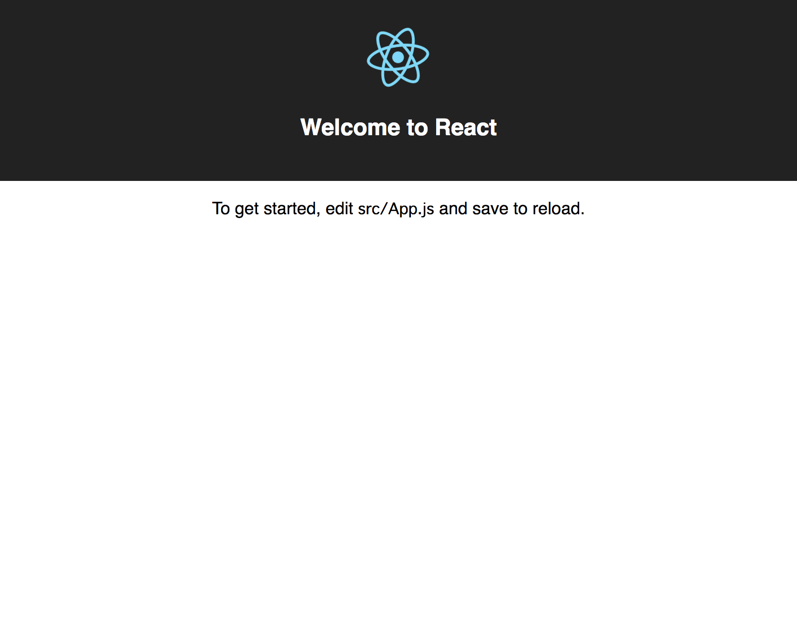

# Part 1 - Getting Started
## Overview
Before we can make anything crazy, we need to get React running. This part focuses on getting React up and running and customizing it slightly.

## Goals
By the end of this section you will have done the following:
* Stood up a React development environment with `create-react-app`
* Created a basic landing page.
* Styled the basic landing page with CSS.

## Step 1 - Get `create-react-app` Running
This step can be easily completed by referring to the [Quick Overview](https://github.com/facebook/create-react-app#quick-overview) section of the `create-react-app` repo or by doing the following:

```
npx create-react-app <app-name>
cd <app-name>
npm start
```
**Note**: \<app-name> should be replaced with the name of the folder this site will exist in on your machine, such as `my-app`.

After you work through those steps you should see the following in your browser:



If you see the same thing as the image above, or something similar, then you can move onto step 2 where you will customize the page. If you run into any issues or would like to learn more about what `create-react-app` actually does, then I fully recommend you read through the information in the [create-react-app repo](https://github.com/facebook/create-react-app).

## Step 2 - Let's Get to Work
At this point you should have already completed step 1 and should be able to start your React application (`npm start`). If you cannot, please work through the previous step.

Right now the website is pretty basic and doesn't really say anything about who _you_ are. We want to figure out React _and_ make something that you can show off, so let's make this a bit more personal.

The challenge for this step is to customize the starting application and make it more personal to you. During this step, I do not want you to worry about CSS or styling, but rather just focus on the markup and the content.

Since this is the first time you are seeing this, let me explain the semantics of what is below. Some steps will have a section called `rules` and another section called `tasks`. `rules` are restrictions or other requirements that I have for you for the task, these **_must_** be followed. `tasks` are simply what you need to accomplish within the given rules.

---

### Rules
* You may only modify `src/App.js` during this step.
* Do _not_ write any CSS or try to style your page during this step.
* Only use markup for this such as the following:
    ```
    <div>
        <h1>About Me</h1>
        <p>
           Lorem ipsum dolor amet williamsburg knausgaard chillwave,    
           post-ironic vinyl mixtape freegan meditation forage tousled 
           craft beer green juice hexagon letterpress neutra.
        </p>
    </div>
    ```

### Tasks
1. Add the following sections to your site (note: each section should just be a header and some text content):
    * About Me - A short paragraph describing who you are, what your hobbies are, etc.
    * My Skills - An unordered list with what technology you are proficient in (bonus points if you link to the homepage for each technology).
    * Contact Me - Using any markup you desire, list your email, phone number, and address. Note that you can put fake information here, especially if you are going to be sharing this with me/others to get feedback.

## Step 3 - Let's Pretty It Up
At this point you should have a basic, unstyled website with some information about you. It's pretty plain, so I think it's about time we fixed that. Before we get into the `rules` and `tasks` for this section, let's explain some caveats about React that you may run into:

### Attributes on Elements
#### `class` vs `className`
When you first looked at `src/App.js` you may have noticed that the elements had `className` instead of `class`, which is what you would have in standard HTML. Why?

If you've ever looked at [DOM elements](https://developer.mozilla.org/en-US/docs/Web/API/Element) in JavaScript, then you'll likely know why. The short answer is that the actual attribute in JavaScript which references the class on an HTML element is `className`. There are other various reasons and philosphies behind it, but you can research those in more detail if you'd like.

In modern React you can use either `class` or `className`, though you may see the following message in your console if you use `class`:
```
Warning: Invalid DOM property `class`. Did you mean `className`?
```

I would suggest you get used to using `className`, especially since other libraries such as [Preact](https://preactjs.com/) require it.

### Others
There are other slight differences in attributes in React versus plain HTML, and rather than regurgitate information and worry about whether or not it is current, I highly recommend you read [Differences In Attributes](https://reactjs.org/docs/dom-elements.html#differences-in-attributes) from the official React documentation. It's short and to the point.

With that knowledge, you're ready to get started.

---

### Rules
* You may only modify `src/App.css` during this step.

### Tasks
1. Style your page using classes on the elements you put together in the previous step.
2. This is _very_ freeform, it is to drill into your head that you should use `className` rather than `class`, so there's not much else to say here.
3. Make it pretty!

## References
* [React](https://reactjs.org/)
* [Preact](https://preactjs.com/)
* [Create React App](https://github.com/facebook/create-react-app)
